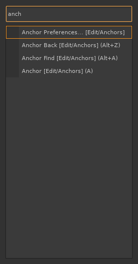
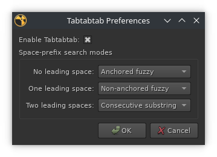

# tabtabtab

A faster, smarter command palette for [Foundry's Nuke](https://www.foundry.com/products/nuke) — replaces the built-in Tab menu with anchored fuzzy search, per-category colour blocks, node icons, and instant access to every menu item in Nuke.

---

## Contents

- [Why tabtabtab instead of Nuke's built-in Tab menu?](#why-tabtabtab-instead-of-nukes-built-in-tab-menu)
- [Screenshots](#screenshots)
- [Demo GIFs](#demo-gifs)
- [Search modes](#search-modes)
- [Keyboard shortcuts](#keyboard-shortcuts)
- [Installation](#installation)
- [Your first node — a 60-second tour](#your-first-node--a-60-second-tour)
- [Preferences](#preferences)
- [Troubleshooting](#troubleshooting)
- [Weighting](#weighting)
- [Colour blocks](#colour-blocks)
- [Compatibility](#compatibility)
- [License](#license)
- [Attribution](#attribution)

---

## Why tabtabtab instead of Nuke's built-in Tab menu?

| Feature | tabtabtab | Nuke built-in |
|---------|-----------|---------------|
| Anchored fuzzy matching ("blr" → Blur) | Yes | No — matches anywhere, so "blr" returns dozens of unrelated results |
| Finds menu items (e.g. File > Exit) | Yes | No — nodes only |
| Per-category colour blocks | Yes | No |
| Node icons in results | Yes | No |
| Keyboard shortcuts in results | Yes | No |
| Usage-weighted ranking | Yes | Yes — but displays the weight number, which is redundant since ordering already reflects it |

**Anchored fuzzy matching** is the key difference. When you type "blr", tabtabtab matches "Blur" because the letters appear in order from the start of a word. Nuke's built-in menu uses non-anchored matching, which returns every item that contains those letters anywhere — usually dozens of irrelevant results for short queries.

**Menu items, not just nodes.** Type "exit" and tabtabtab shows "File > Exit". Type "pref" and it shows "Edit > Preferences". No more mousing through the menu bar.

---

## Screenshots

Node icons in the left column and colour-coded rows by node category:

Category search — type `[` to include the category tag in your search (`ax[3` → Axis [3D]):

Menu items appear alongside nodes — type `anch` to find Edit > Anchors commands:

Non-anchored search (leading space) — matches letters anywhere in the name:

---

## Demo GIFs

**Basic usage** — open the palette, pick a node, create it:

**Anchored fuzzy search** — letters match in order from the start of a word:

**Non-anchored search** — add a leading space to match anywhere in the name:

**Colours and icons** — colour blocks and node icons in action:

**Category filter** — narrow results by category using `[`:

**Repeat previous** — Tab again after creating a node to recreate it instantly:

---

## Search modes

The table below shows the **default** space-prefix → mode mapping. The mapping is configurable; see [Preferences](#preferences) to remap which mode is triggered by each space level.

| Prefix | Default behaviour |
|--------|-------------------|
| (none) | Anchored fuzzy match. Each character of your query must appear in order, starting from the beginning of the node name. "blr" matches "Blur" but not "ColorBurn". |
| one space | Non-anchored fuzzy match. Characters must appear in order anywhere in the name. " blr" matches both "Blur" and "ColorBurn". |
| two spaces | Non-anchored consecutive substring. The exact run of letters must appear somewhere in the name. "   blur" matches "MotionBlur" but not "Blur2". |
| `[` | Include the category tag in the search. "ax[3d" narrows results to items whose category contains "3d", e.g. "Axis [3D]". Without `[`, the category tag is ignored. |

### Space-prefix repeat behaviour

After you create a node, tabtabtab pre-fills the search field with a leading space followed by the node's display name (for example, " Blur [Filter]"). The next time you press Tab to open the palette, that text is already in the field. Press Tab again without typing anything and the same node is created immediately — no searching required.

The leading space is intentional: it enables non-anchored matching so the full display name (which includes the category tag) matches correctly against itself.

---

## Keyboard shortcuts

| Key | Action |
|-----|--------|
| Tab or Enter | Create the selected item |
| Up / Down arrows | Navigate the result list |
| Escape | Close without creating |

Ctrl+Tab still opens Nuke's built-in tab menu.

---

## Installation

1. Download the latest release `.zip` from the [Releases](../../releases) page.

2. Extract the contents into your Nuke plugin directory. The typical location is `~/.nuke/`. Alternatively, place the files anywhere on your `NUKE_PATH`.

   The zip contains these five files — all of them are required:

   - `tabtabtab_nuke_core.py` — core palette engine
   - `tabtabtab_nuke.py` — Nuke menu integration
   - `menu.py` — auto-registration on Nuke startup
   - `tabtabtab_prefs.py` — preferences persistence
   - `tabtabtab_prefs_dialog.py` — preferences dialog (Edit > Tabtabtab Preferences...)

   > **Already have a `menu.py` in `~/.nuke/`?** Nuke runs one `menu.py` per directory, so copying this one straight into `~/.nuke/` will overwrite yours. The cleanest fix is to put the tabtabtab files in their **own directory** on `NUKE_PATH` (e.g. `~/.nuke/tabtabtab/`) — Nuke runs each directory's `menu.py` independently, so there's no collision. See [Troubleshooting](#troubleshooting).

3. Start (or restart) Nuke. tabtabtab registers automatically via `menu.py`. Press Tab in the Node Graph to open the palette.

---

## Your first node — a 60-second tour

Once installed, this is the whole workflow:

1. **Open the palette.** Hover over the Node Graph and press **Tab**.
2. **Type a few letters.** Try `blr`. tabtabtab uses *anchored* matching, so `blr` jumps straight to **Blur** — the letters match in order from the start of the word.
3. **Pick a result.** Use **Up / Down** to move through the list. The colour block on the left and the node icon tell you the category at a glance.
4. **Create it.** Press **Enter** (or **Tab** again) to drop the selected node into your graph. Press **Escape** to back out without creating anything.

### Now do the thing the built-in menu can't: find *commands*, not just nodes

This is the feature that makes tabtabtab worth installing. Nuke's built-in Tab menu only finds nodes — to run a menu command you have to hunt through the menu bar with the mouse. tabtabtab searches **every menu item in Nuke** the same way it searches nodes:

1. Press **Tab** to open the palette.
2. Type `exit` → tabtabtab surfaces **File > Exit**. Press **Enter** to run it.
3. Try `pref` → **Edit > Preferences**. Or `anch` → the **Edit > Anchors** commands. Or the name of any command buried three menus deep.

Anything you'd normally click through the menu bar to reach is now one Tab and a few keystrokes away — that's the real upgrade over the built-in menu.

### A few more things to try

- **Repeat the last node instantly.** After creating a node, press **Tab Tab** (open the palette, then Tab again without typing) and the same node is recreated. The field is pre-filled with the last node's name, so a second Tab just confirms it.
- **Search anywhere in the name.** Start your query with a leading space (` blr`) to match letters anywhere in the name instead of only from the start. See [Search modes](#search-modes) for all the prefixes.

---

## Preferences

Open **Edit > Tabtabtab Preferences...** to access the preferences dialog.

- **Enable tabtabtab** — uncheck to disable the plugin and restore Nuke's default Tab behaviour. Changes take effect immediately without restarting Nuke.

- **Space-prefix search modes** — assign which search mode is triggered by zero, one, or two leading spaces. Each of the three modes (Anchored fuzzy, Non-anchored fuzzy, Consecutive substring) must be assigned to exactly one space level. Defaults match the [Search modes](#search-modes) table above.

---

## Troubleshooting

**Pressing Tab does nothing / the old Nuke menu appears.**

- Make sure the palette is enabled in **Edit > Tabtabtab Preferences...** (the **Enable tabtabtab** checkbox).
- Confirm the plugin actually loaded. Open the Nuke Script Editor and check the output, or start Nuke from a terminal — `menu.py` prints a traceback there if registration failed.
- Press Tab while the mouse is over the **Node Graph**. Tab is context-sensitive in Nuke and only opens the palette in the Node Graph pane.
- `Ctrl+Tab` always opens Nuke's built-in tab menu, so you can fall back to it any time.

**The "Tabtabtab Preferences..." item isn't in the Edit menu.**

This means `menu.py` didn't run — almost always a file-placement problem. See the next item.

**It worked before I installed this, but now another `~/.nuke` tool is broken (or vice versa).**

Nuke runs the `menu.py` in each directory on `NUKE_PATH`. The usual cause is overwriting an existing `~/.nuke/menu.py` when copying the files in. Fix it one of two ways:

- Put the tabtabtab files in their **own folder** on `NUKE_PATH` (e.g. `~/.nuke/tabtabtab/`), so its `menu.py` doesn't collide with any other. This is the recommended layout.
- Or, if you must keep everything in one `~/.nuke/menu.py`, paste the contents of tabtabtab's `menu.py` into your existing one rather than replacing the file.

**Nodes I use constantly aren't ranked first.**

Ranking is usage-weighted and learns over time — see [Weighting](#weighting). Newly installed, every node starts equal; the order improves as you create nodes. Weights persist in `~/.nuke/tabtabtab_weights.json`; delete that file to reset ranking.

**Results show no colour blocks.**

Nodes whose tile colour is Nuke's global default (no class-specific colour) are intentionally shown without a colour block. See [Colour blocks](#colour-blocks).

---

## Weighting

Each time you create a node, its usage weight increases. Higher-weighted nodes appear earlier in results when multiple items match your query. Weights are saved to `~/.nuke/tabtabtab_weights.json` between sessions.

---

## Colour blocks

Each result row is tinted with the node's tile colour as defined in Nuke:

- The left column shows a solid colour block at full opacity (the node's tile colour).
- The row background receives a semi-transparent wash of the same colour (~31% opacity).
- Text colour adjusts automatically for legibility (dark text on bright backgrounds, light text on dark backgrounds).

Nodes whose tile colour is the Nuke global default (no class-specific colour) are shown without colour blocks.

---

## Compatibility

- **Nuke 13 and later** (PySide2)
- **Nuke 15 and later** (PySide6)

Both Qt bindings are supported. The correct one is selected automatically at import time.

---

## License

Released into the public domain under [The Unlicense](LICENSE). Do whatever you like with it.

---

## Attribution

tabtabtab is based on [dbr/tabtabtab](https://github.com/dbr/tabtabtab) by dbr, which appears to be no longer maintained. This fork extends the original with multi-monitor support, visual improvements (colour blocks, node icons), PySide6 compatibility, and CI/CD infrastructure.
