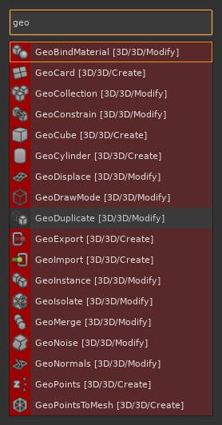
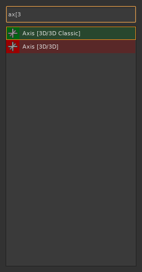
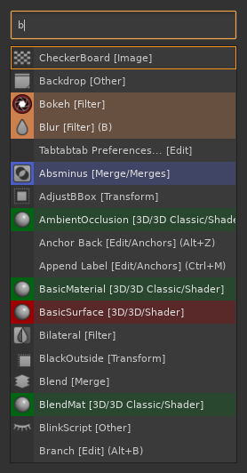

# tabtabtab

A faster, smarter command palette for [Foundry's Nuke](https://www.foundry.com/products/nuke) — replaces the built-in Tab menu with anchored fuzzy search, per-category colour blocks, node icons, and instant access to every menu item in Nuke.

---

## Why tabtabtab instead of Nuke's built-in Tab menu?

| Feature | tabtabtab | Nuke built-in |
|---------|-----------|---------------|
| Anchored fuzzy matching ("blr" → Blur) | Yes | No — matches anywhere, so "blr" returns dozens of unrelated results |
| Finds menu items (e.g. File > Exit) | Yes | No — nodes only |
| Per-category colour blocks | Yes | No |
| Node icons in results | Yes | No |
| Keyboard shortcuts in results | Yes | No |
| Usage-weighted ranking | Yes | Yes — but displays the weight number, which is redundant since ordering already reflects it |

**Anchored fuzzy matching** is the key difference. When you type "blr", tabtabtab matches "Blur" because the letters appear in order from the start of a word. Nuke's built-in menu uses non-anchored matching, which returns every item that contains those letters anywhere — usually dozens of irrelevant results for short queries.

**Menu items, not just nodes.** Type "exit" and tabtabtab shows "File > Exit". Type "pref" and it shows "Edit > Preferences". No more mousing through the menu bar.

---

## Screenshots

Node icons in the left column and colour-coded rows by node category:

Category search — type `[` to include the category tag in your search (`ax[3` → Axis [3D]):

Menu items appear alongside nodes — type `anch` to find Edit > Anchors commands:

Non-anchored search (leading space) — matches letters anywhere in the name:

---

## Demo GIFs

**Basic usage** — open the palette, pick a node, create it:

**Anchored fuzzy search** — letters match in order from the start of a word:

**Non-anchored search** — add a leading space to match anywhere in the name:

**Colours and icons** — colour blocks and node icons in action:

**Category filter** — narrow results by category using `[`:

**Repeat previous** — Tab again after creating a node to recreate it instantly:

---

## Search modes

| Prefix | Behaviour |
|--------|-----------|
| (none) | Anchored fuzzy match. Each character of your query must appear in order, starting from the beginning of the node name. "blr" matches "Blur" but not "ColorBurn". |
| one space | Non-anchored fuzzy match. Characters must appear in order anywhere in the name. " blr" matches both "Blur" and "ColorBurn". |
| two spaces | Non-anchored consecutive substring. The exact run of letters must appear somewhere in the name. "   blur" matches "MotionBlur" but not "Blur2". |
| `[` | Include the category tag in the search. "ax[3d" narrows results to items whose category contains "3d", e.g. "Axis [3D]". Without `[`, the category tag is ignored. |

### Space-prefix repeat behaviour

After you create a node, tabtabtab pre-fills the search field with a leading space followed by the node's display name (for example, " Blur [Filter]"). The next time you press Tab to open the palette, that text is already in the field. Press Tab again without typing anything and the same node is created immediately — no searching required.

The leading space is intentional: it enables non-anchored matching so the full display name (which includes the category tag) matches correctly against itself.

---

## Keyboard shortcuts

| Key | Action |
|-----|--------|
| Tab or Enter | Create the selected item |
| Up / Down arrows | Navigate the result list |
| Escape | Close without creating |

Ctrl+Tab still opens Nuke's built-in tab menu.

---

## Quickstart / Installation

1. Download the latest release `.zip` from the [Releases](../../releases) page.

2. Extract the contents into your Nuke plugin directory. The typical location is `~/.nuke/`. Alternatively, place the files anywhere on your `NUKE_PATH`.

   The zip contains these five files — all of them are required:

   - `tabtabtab_nuke_core.py` — core palette engine
   - `tabtabtab_nuke.py` — Nuke menu integration
   - `menu.py` — auto-registration on Nuke startup
   - `tabtabtab_prefs.py` — preferences persistence
   - `tabtabtab_prefs_dialog.py` — preferences dialog (Edit > Tabtabtab Preferences...)

3. Start (or restart) Nuke. tabtabtab registers automatically via `menu.py`. Press Tab in the Node Graph to open the palette.

---

## Preferences

Open **Edit > Tabtabtab Preferences...** to access the preferences dialog.

- **Enable tabtabtab** — uncheck to disable the plugin and restore Nuke's default Tab behaviour. Changes take effect immediately without restarting Nuke.

---

## Weighting

Each time you create a node, its usage weight increases. Higher-weighted nodes appear earlier in results when multiple items match your query. Weights are saved to `~/.nuke/tabtabtab_weights.json` between sessions.

---

## Colour blocks

Each result row is tinted with the node's tile colour as defined in Nuke:

- The left column shows a solid colour block at full opacity (the node's tile colour).
- The row background receives a semi-transparent wash of the same colour (~31% opacity).
- Text colour adjusts automatically for legibility (dark text on bright backgrounds, light text on dark backgrounds).

Nodes whose tile colour is the Nuke global default (no class-specific colour) are shown without colour blocks.

---

## Compatibility

- **Nuke 13 and later** (PySide2)
- **Nuke 15 and later** (PySide6)

Both Qt bindings are supported. The correct one is selected automatically at import time.

---

## Attribution

tabtabtab is based on [dbr/tabtabtab](https://github.com/dbr/tabtabtab) by dbr, which appears to be no longer maintained. This fork extends the original with multi-monitor support, visual improvements (colour blocks, node icons), PySide6 compatibility, and CI/CD infrastructure.
